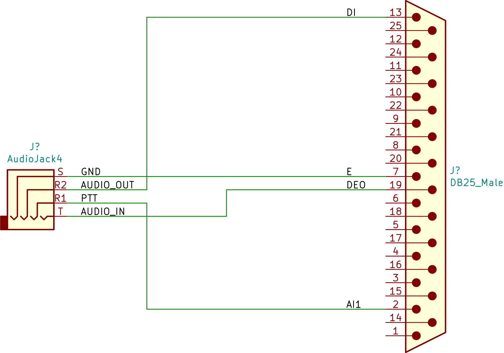

# tk-x90-tnc-adapter
Adapter for TK-x90 radios for connecting to Mobilinkd TNCs.

This repo contains both the schematics for the connector and the 3D models
needed to print the shell.  The models are designed to be held together with
two M3 socket cap screws.

<table>
  <tr>
    <td>
      

        
      

    </td>
  </tr>
  </tr>
    <td>
      

        
      

    </td>
  </tr>
</table>

## BOM

 * [DB-25 Male Solder-cup Connector](https://www.digikey.com/product-detail/en/assmann-wsw-components/A-DS-25-LL-Z/AE10984-ND/1241785)
 * [3.5mm 4-pole Panel-mount Jack](https://www.digikey.com/product-detail/en/cui-devices/SJ1-43502PM/CP-SJ1-43502PM-ND/5130707)
 * 2 M3x12 Flat Head Screws (I used socket cap screws)
 * 2 M3 Hex Nuts
 * 2 #4-40 7.92mm Screws
 * Hookup wire
 * A [4-pole 3.5mm male to male cable](https://amzn.to/2YJ26tz)

